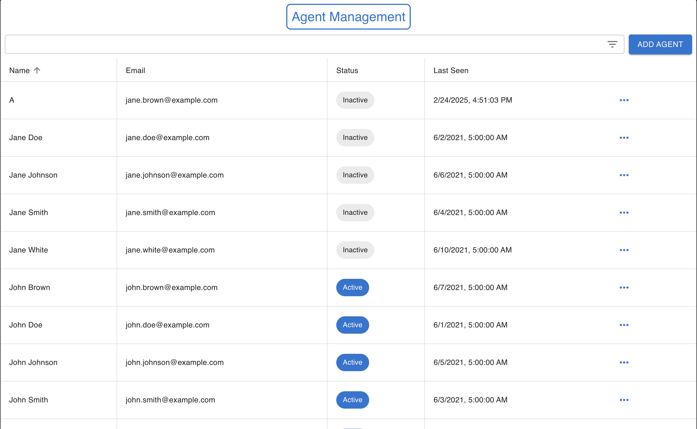
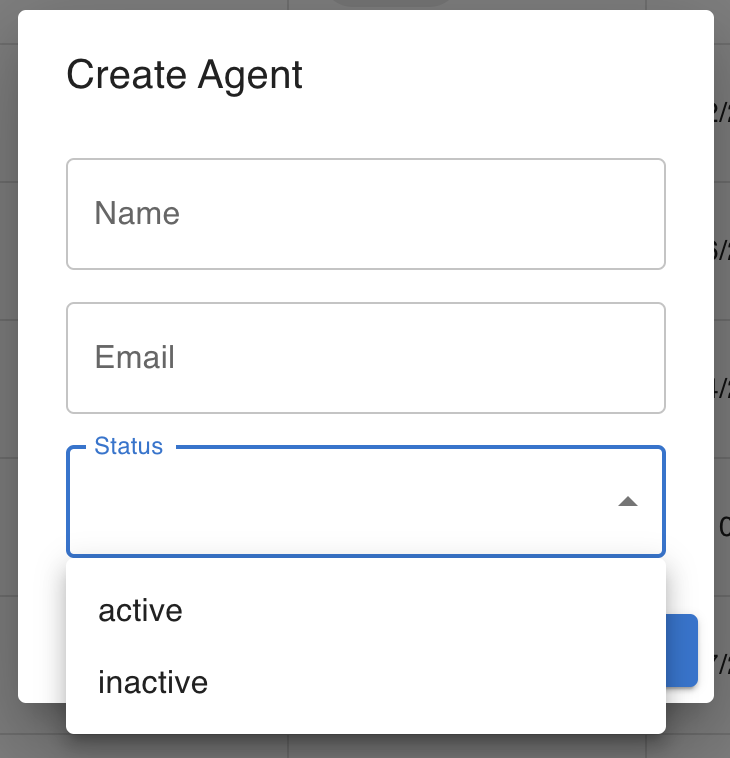
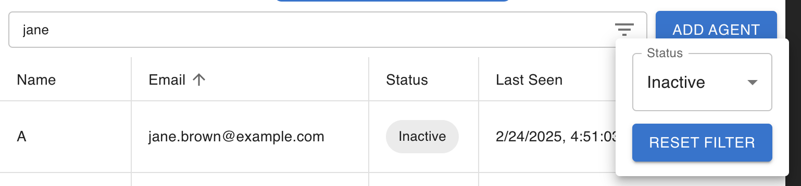
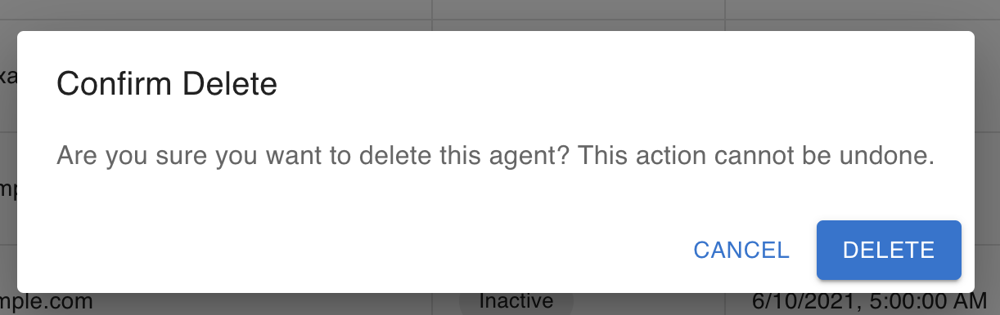

# Coffee Labs Take Home Assignment

This agent management app is built with Typescript, React, and Material-UI. I named it Coffee Labs as a play on the company's name so that other applicants are not able to find this entry. This is a CRUD application that allows users to create agents with a name, email, and status. It also reads the last seen time and converts it to a human readible string.

## Live Demo
For the interviewer's convenience, I decided to host the project on Vercel so that I could generate a preview link

[View Preview](https://coffee-labs-take-home-assignment.vercel.app/)

## Run the Application

Running the application is simple and can be achieved through the following steps:

- `git clone` in preferred directory
- `npm install`
- `npm start `

## Implementation Details and Reasonings
1. Initially, I planned to use create-react-app (CRA) for bootstrapping the project, but I switched to Vite due to CRA's deprecation. Vite proved to be an excellent alternative because it is very easy to set up. For the purpose of this take-home assignment, I needed a quick and efficient setup, and Vite met those requirements perfectly.

2. This application includes Material-UI (MUI) components to reduce engineering time, keep styling consistent and inherit built in MUI animations. Rather than using React Table, AG Grid, or other data table libraries, I chose to use MUI because it allows me to demonstrate my knowledge in modern frameworks and core technical skills while saving time. In development for the company, I may use other frameworks that will allow me to save more time, however, for the purpose of this assignment, I thought it was best to showcase my fundamentals.

3. The agent manager adheres to engineering best practices for create, edit, and delete functionality, thus, for me, the logical next step was to create the search and filter functionality. I decided to add a search bar so that users may filter agents by name and email, as well as a filter icon that allows users to filter through status. This design was built with the consideration of future scalability. In the case that there is a requirement to add additional fields or allow users to add custom fields, there should be a means to filter with those fields as well.

4. I created an array that contains some mock data so that users can immediately interact with the edit and delete functionality.

5. I used TypeScript, React, and localStorage to fulfill the requirements of the assignment. All the must have requirements are complete.

## Images of Core Screens
Main View

Create/Edit View

Filter View

Delete View

## SHORT Video Demo

